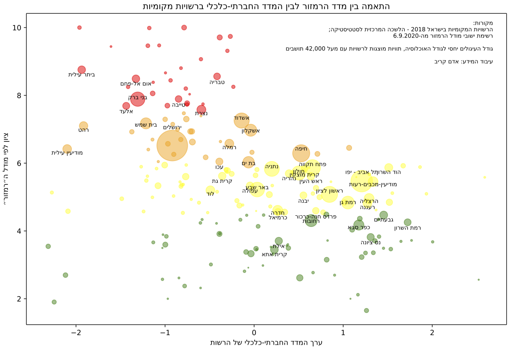
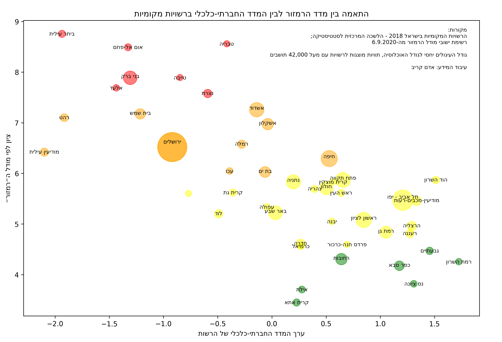

# Correlation between the 'Ramzor' index and socio-economic index for cities in Israel

[Notebook](Ramzor-Correlation.ipynb)

## Sources:

- [2018 LAMAS data](2018.xlsx)
- [Ramzor data file as of 6/9/2018](cities_ramzor_publicb-q.xlsx)

## Result:

- Full scatter plot:

- Only cities with > 40k population

